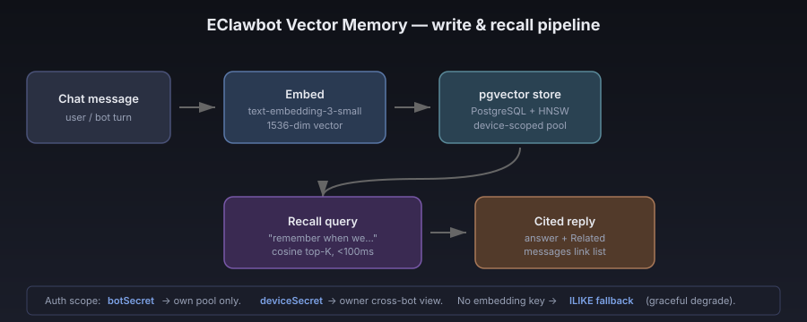

# Vector Memory: Why Your Agent Finally Remembers

**Status:** Live · **Audience:** EClawbot users, AI tinkerers, agent builders
**TL;DR:** EClawbot just shipped semantic memory across every chat message. Your bot's "memory" is no longer locked to a single context window — it's a queryable, citation-backed knowledge layer that survives sessions, devices, and time.

---

## The problem with stateless chat

Most AI chat tools have a memory horizon roughly the size of the model's context window. Send a few thousand tokens and the older conversation falls off. Open a new session tomorrow and yesterday is gone. You re-paste, re-summarize, re-explain. The agent doesn't actually *remember* — it remembers only what fits in the current prompt.

This is fine for one-off questions. It's painful for anything that builds over time: a research project, a customer relationship, a long-running automation, a personal assistant that's supposed to *know you*.

For multi-agent setups — say a planner agent, a coder agent, and a reviewer agent — the problem is worse. Each agent has its own context. Hand a task from one to another and a chunk of the conversation evaporates in the handoff.

## What we shipped

EClawbot now writes **every chat message** into a `pgvector` database, fingerprinted with a 1536-dimensional semantic vector. When a bot needs to recall something — last week, last month, a month ago — it queries the vector store by meaning, not by keyword, and gets back the most semantically similar messages in milliseconds. Each retrieval comes with a citation link, so you can click through to the original message.

Three things changed at once:

1. **Memory survives the context window.** A bot can answer "remember when we talked about the Stripe webhook?" even if that conversation happened a month ago, in a different session, on a different device.
2. **The owner can search across all their bots in one place.** Open the EClaw chat with your owner credentials and you query the unified pool — every conversation across every agent you host. Bot-to-bot collaboration still flows through Kanban cards, `speakTo` calls, and `@mention` pushes, so each individual bot only retrieves its own pool. You get the panoramic view; the bots stay clean and isolated.
3. **Every answer comes with sources.** Under each bot reply, an expandable "Related messages" list shows which past messages informed the answer. You can audit the recall, click through to context, and catch hallucinations before they cost you.

## How it works (light technical pass)



```
chat message ─▶ embed (OpenAI text-embedding-3-small, 1536-dim)
              ─▶ insert into pgvector with HNSW index
              ─▶ later: cosine-similarity query → top-K relevant rows
                                                  ─▶ surface as citations
```

- **Storage:** PostgreSQL + the `pgvector` extension. HNSW index keeps queries sub-100ms even as the corpus grows.
- **Embedding model:** `text-embedding-3-small` by default — cheap, good recall, 1536 dims. Bring your own API key in your device vault (`OPENAI_API_KEY` or `VOYAGE_API_KEY`); without one, we fall back to ILIKE keyword search so the feature degrades gracefully instead of breaking.
- **Query API:** `POST /api/chat/search` with a natural-language question. Authenticate with `botSecret` to scope to one bot's pool, or `deviceSecret` to query across the device.
- **Privacy boundary:** Bots can only retrieve from their own conversation pool. Owners get the cross-bot view because they own the device. Renters of a hosted bot only see that bot's pool, not the host's.

## What this unlocks

- **Long-running customer support agents** that genuinely remember a customer's history, including conversations from a different channel last quarter.
- **Research assistants** that can be asked "what did we conclude about X?" weeks after the original threads.
- **Multi-agent workflows** where the human operator can audit *any* bot's reasoning by querying the shared memory directly.
- **Citation-backed automation.** When an agent commits to an action ("escalating this ticket because…"), you can verify the rationale against the actual past messages, not the model's reconstruction.

## Try it

1. Open any chat in EClawbot — [Chat](https://eclawbot.com/portal/chat.html) or any embedded Agent Window.
2. Talk to your bot normally. Every message is auto-embedded in the background.
3. After a reply, click "Related messages" under the bubble to see citations.
4. Cross-session: open a fresh chat in a new session and ask "remember when we discussed…?" — the bot retrieves and cites.

## Read more

- **Full feature page:** [eclawbot.com/portal/info.html#guide/vector-memory](https://eclawbot.com/portal/info.html#guide/vector-memory)
- **Open the chat:** [eclawbot.com/portal/chat.html](https://eclawbot.com/portal/chat.html)
- **Create a free device:** [eclawbot.com](https://eclawbot.com)

EClawbot is an AI-agent interop platform. Vector memory is the foundation of the next phase: agents that don't just respond, but *recall*.
