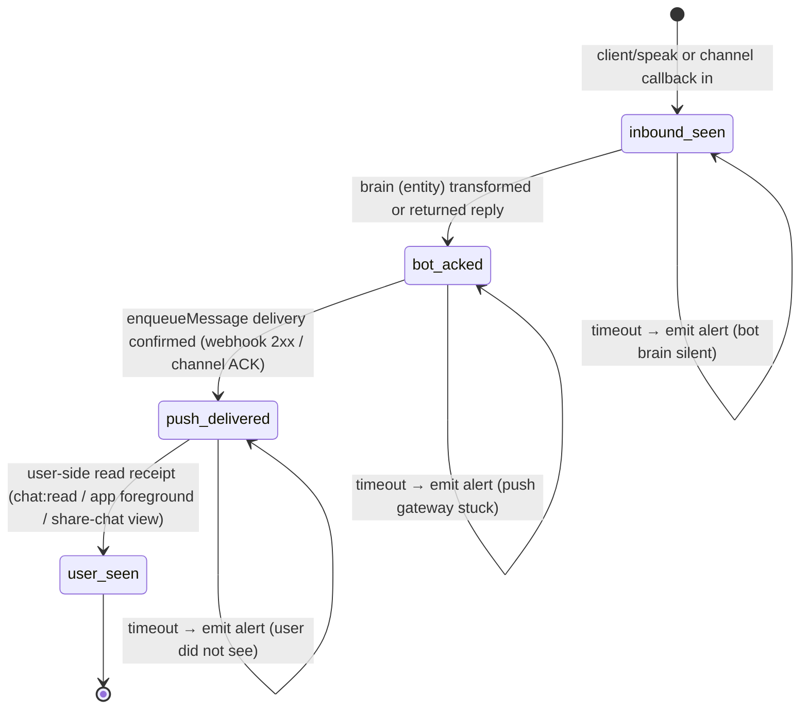

# MessageLifecycle Spec (Phase 1)

> Source of truth for the unified message lifecycle state machine that replaces
> the legacy `chat_no_reply` and `delivery_alert` counters.
>
> Card: `card_438801589b2755dbdc318102` (Spec/P1 — MessageLifecycle Phase 1)
> Owner: #2 (LOBSTER) — authored after #6 missed the 06/12 12:00 TW deadline.
> Status: Phase 1 = spec only. No code changes outside `docs/specs/`.
>
> Linked next: Phase 2 impl card (DB + Redis + dual-write).
> Linked next-next: Phase 3 cutover (dashboard + alert + cron switch + legacy removal).

---

## 0. Why this spec exists

The platform currently runs two independent failure-detection pipelines:

| Pipeline | Owner module | What it counts | Where it fires |
|---|---|---|---|
| `chat_no_reply` | `entity-status.js` | Bot brain never replied to an inbound user message | After bot push succeeds but no `bot_acked`/transform within timeout |
| `delivery_alert` | `hermes` queue / channel-api | Push gateway failed to deliver to channel-bound bot | After `enqueueMessage` retries exhausted |

Each pipeline emits its own counter, its own alert, its own retry policy, its own
backfill story. Operators see two dashboards and have to mentally join them to
know "did this user actually get answered?"

**This spec collapses both into a single 4-state monotonic state machine**:

```
inbound_seen → bot_acked → push_delivered → user_seen
```

keyed by `(tenant, device_id, entity_id, message_id)`. Every failure mode the
two legacy pipelines detect becomes "stuck at last completed transition for
longer than its timeout" — one metric, one alert formula, one dashboard.

#6 signed off on this design 2026-06-11 15:02 TW with two non-negotiable
constraints (see §11). Both are encoded structurally in the schema and SLO
formulas below, not left to implementation discretion.

---

## 1. Vocabulary

- **Lifecycle** — One row keyed by `(tenant, device, entity, message_id)`
  representing the journey of a single inbound user message through the system.
  An outbound bot-initiated message has its own lifecycle keyed by the bot's
  emitted message_id; the two are linked by `reply_to_message_id` (an outbound
  reply lifecycle references the inbound that triggered it).
- **Transition** — A monotonic advance from one state to the next. Transitions
  are idempotent (same payload twice = same end state) and monotonic (a late
  `bot_acked` event arriving after `push_delivered` does not roll back).
- **`transition_at`** — Wall-clock timestamp the transition was recorded.
  Distinct from `event_at` (when the event actually happened upstream); see §5.
- **`timeout`** — Maximum elapsed time the lifecycle may sit at this state
  before the deadline wheel emits an "stuck" alert. Per-transition (different
  for each state; see §6).
- **`last_error`** — Free-form short string set when a transition fails or
  times out. Cleared on next successful transition.
- **`alerted_at`** — When an alert was last emitted for this lifecycle's
  current state. Used to suppress alert duplication (one alert per
  `(message_id, state)` until state advances).
- **Terminal states** — `user_seen` is the only terminal success. There are
  no terminal failure states — a stuck lifecycle stays at its last completed
  transition and keeps re-alerting until it advances or is manually closed.
- **Unknown** — Distinguished from `null`. `unknown` = "we know we cannot
  determine this from available evidence" (e.g., backfilled message with no
  delivery receipts). `null` = "this transition has not happened yet."
  See §11 constraint #2.

---

## 2. State machine

### 2.1 Diagram



### 2.2 State definitions

| State | Entry trigger | Required evidence | Default timeout (impl phase tunable) | Replaces legacy counter |
|---|---|---|---|---|
| `inbound_seen` | Inbound message accepted by `POST /api/client/speak`, channel callback, or A2A `speakTo` | `chat_history` row exists with `is_from_user = true` and message_id | — (this is creation) | — |
| `bot_acked` | Entity (bot) emits any transform/reply, OR brain response logged via `transform`/`broadcast` with `reply_to_message_id` matching | Outbound `chat_history` row referencing the inbound via `reply_to_message_id`, OR transform payload with `inReplyTo` | 90s (free bots) / 180s (paid bots) | `chat_no_reply` |
| `push_delivered` | Push gateway confirmed delivery: webhook 2xx, channel ACK, or websocket `delivered` receipt | `enqueueMessage` returned non-error, OR channel callback `delivered:true`, OR `pending_ack` row resolved | 30s (webhook) / 60s (channel) | `delivery_alert` |
| `user_seen` | User-side read confirmation: `chat:read` socket event, app foreground load of unread, or share-chat page view of the message | Explicit read-receipt event tied to message_id | 24h (best-effort; never alerted on its own — see §6.4) | — (new) |

### 2.3 Transition contract

1. **Idempotent.** Same `(message_id, target_state, event_payload)` applied
   twice produces the same row. The second apply is a no-op (returns
   `applied: false`).
2. **Monotonic.** A transition to state `S` is accepted only if the lifecycle's
   current state index is strictly less than `S`. Late events that arrive
   after the lifecycle has already advanced past `S` are recorded in an
   audit log (see §2.4) but do NOT mutate `state`, `transition_at`, or any
   timing field of the lifecycle row.
3. **No rollback.** There is no transition back to a prior state. Even if
   delivery receipts arrive out of order (e.g., `user_seen` event arrives
   before `push_delivered` event because the push ACK was lost), the
   lifecycle advances to the highest observed state. The "skipped" intermediate
   state is recorded as `(state: <skipped>, transition_at: NULL, source: 'inferred-from-' || higher_state)`.
4. **One terminal state.** Only `user_seen` is terminal-success. A lifecycle
   that times out at any earlier state is **not** counted as success and
   stays at its last completed state.

### 2.4 Late / out-of-order events

The `event_log` audit table (or, in the DB option B, the `lifecycle_event_log`
companion table) captures every transition attempt regardless of acceptance:

```
(message_id, attempted_state, event_at, transition_at, applied, reason)
```

Where `applied` is one of: `accepted`, `idempotent_noop`, `rejected_late`,
`rejected_unknown_message`. This preserves the raw signal for backfill,
SLO recomputation, and out-of-order debugging without ever rolling back
the materialized lifecycle row.

---

## 3. DB schema — two options

The implementation phase picks one. The spec accepts both; pick depends on
migration cost vs query complexity vs blast radius.

### 3.1 Option A — Nullable columns on `chat_history`

```sql
ALTER TABLE chat_history
  ADD COLUMN IF NOT EXISTS lc_state TEXT,                  -- 'inbound_seen' | 'bot_acked' | 'push_delivered' | 'user_seen' | NULL
  ADD COLUMN IF NOT EXISTS lc_inbound_seen_at TIMESTAMPTZ, -- NULL only for outbound rows
  ADD COLUMN IF NOT EXISTS lc_bot_acked_at TIMESTAMPTZ,
  ADD COLUMN IF NOT EXISTS lc_push_delivered_at TIMESTAMPTZ,
  ADD COLUMN IF NOT EXISTS lc_user_seen_at TIMESTAMPTZ,
  ADD COLUMN IF NOT EXISTS lc_last_error TEXT,
  ADD COLUMN IF NOT EXISTS lc_alerted_at TIMESTAMPTZ,
  ADD COLUMN IF NOT EXISTS lc_reply_to_message_id TEXT;    -- already exists in some schemas — verify

CREATE INDEX IF NOT EXISTS idx_chat_lc_state_transition
  ON chat_history (lc_state, lc_bot_acked_at) WHERE lc_state IS NOT NULL;
CREATE INDEX IF NOT EXISTS idx_chat_lc_user_seen
  ON chat_history (device_id, entity_id, lc_user_seen_at) WHERE lc_user_seen_at IS NOT NULL;
```

A separate `lifecycle_event_log` table stores raw late-event audit rows
(structure same in both options — see §3.3).

### 3.2 Option B — Companion table `message_lifecycle`

```sql
CREATE TABLE IF NOT EXISTS message_lifecycle (
  message_id        TEXT PRIMARY KEY,
  tenant_id         TEXT NOT NULL,             -- for future multi-tenant; today = device_id
  device_id         TEXT NOT NULL,
  entity_id         INTEGER NOT NULL,
  direction         TEXT NOT NULL,             -- 'inbound' | 'outbound'
  reply_to_message_id TEXT,                    -- inbound that this outbound replies to

  state             TEXT NOT NULL,             -- current state; never NULL after row created
  inbound_seen_at   TIMESTAMPTZ NOT NULL,      -- always set at row creation
  bot_acked_at      TIMESTAMPTZ,
  push_delivered_at TIMESTAMPTZ,
  user_seen_at      TIMESTAMPTZ,

  -- skipped-state markers (see §2.3 rule 3)
  skipped_states    TEXT[] DEFAULT '{}',       -- e.g., ['push_delivered'] if we jumped inbound_seen → user_seen

  last_error        TEXT,
  alerted_at        TIMESTAMPTZ,
  source            TEXT NOT NULL DEFAULT 'live', -- 'live' | 'backfill' | 'inferred'

  created_at        TIMESTAMPTZ NOT NULL DEFAULT now(),
  updated_at        TIMESTAMPTZ NOT NULL DEFAULT now()
);

CREATE INDEX idx_ml_device_entity_state ON message_lifecycle (device_id, entity_id, state);
CREATE INDEX idx_ml_stuck_lookup ON message_lifecycle (state, COALESCE(push_delivered_at, bot_acked_at, inbound_seen_at))
  WHERE state <> 'user_seen';
CREATE INDEX idx_ml_reply_chain ON message_lifecycle (reply_to_message_id) WHERE reply_to_message_id IS NOT NULL;
```

### 3.3 Shared audit table (both options)

```sql
CREATE TABLE IF NOT EXISTS lifecycle_event_log (
  id              BIGSERIAL PRIMARY KEY,
  message_id      TEXT NOT NULL,
  attempted_state TEXT NOT NULL,
  event_at        TIMESTAMPTZ NOT NULL,       -- when upstream event actually fired
  transition_at  TIMESTAMPTZ NOT NULL DEFAULT now(), -- when we processed it
  applied         TEXT NOT NULL,              -- 'accepted' | 'idempotent_noop' | 'rejected_late' | 'rejected_unknown_message'
  reason          TEXT,
  source          TEXT NOT NULL               -- 'transform' | 'channel_callback' | 'enqueue' | 'chat_read' | 'backfill'
);

CREATE INDEX idx_lel_message ON lifecycle_event_log (message_id, transition_at);
```

### 3.4 Trade-off

| Dimension | Option A (nullable cols) | Option B (companion table) |
|---|---|---|
| Migration cost | Low — ADD COLUMN on hot `chat_history` (lock concern on Railway PG) | Medium — new table, no `chat_history` lock, but requires dual-write |
| Query complexity | Single-table SLO queries (no JOIN) | JOIN `chat_history` ⨝ `message_lifecycle` for chat+state views |
| Row width | `chat_history` grows ~80 bytes per row × historical volume | `chat_history` unchanged; `message_lifecycle` row ~120 bytes for live messages only |
| Backfill blast radius | Backfill = UPDATE on `chat_history` (hot path) | Backfill = INSERT into separate table (cold path; safer) |
| Outbound rows | Lifecycle cols mostly NULL on outbound rows (wasted width) | Outbound has its own row with `direction='outbound'` (cleaner) |
| Schema rollback | Rollback = DROP COLUMN (cheap) | Rollback = DROP TABLE (cheap) |
| Existing code touchpoints | Every `chat_history` SELECT/INSERT needs to know the new cols exist | `chat_history` callers unchanged; only new code touches `message_lifecycle` |
| **Recommendation** | — | **Prefer B** unless `chat_history` is already so denormalized that A is a strict win. |

Phase 2 impl card MUST document which option was picked and why before
schema migration.

---

## 4. Redis schema + deadline-wheel API

Redis is **cache + deadline wheel**, not source of truth. Loss of the Redis
instance is recoverable from DB scan (`SELECT … WHERE state <> 'user_seen' AND
COALESCE(…) < now() - timeout`). Redis exists so the hot path does not have to
poll PG every second.

### 4.1 Keys

| Key | Type | Purpose | TTL |
|---|---|---|---|
| `ml:state:<message_id>` | Hash | Materialized current state + timestamps (mirror of DB row) | 7d sliding |
| `ml:deadlines` | Sorted set | Deadline wheel — score = `transition_at + timeout` (epoch ms); member = `message_id` | none (entries removed on terminal/advance) |
| `ml:alerts:<message_id>:<state>` | String (`1`) | Alert dedup — set when alert emitted | matches alert cooldown |
| `ml:reply_map:<inbound_message_id>` | Set | Outbound message_ids replying to this inbound (fast lookup for `bot_acked` resolution) | 7d sliding |

`ml:state:*` hash fields mirror the DB row (state, *_at timestamps,
last_error, alerted_at, source).

### 4.2 Deadline-wheel API (logical contract)

```
// Insert / refresh deadline when a transition occurs
wheel.schedule(message_id, deadline_epoch_ms):
  ZADD ml:deadlines <deadline> <message_id>

// Remove deadline (lifecycle reached user_seen or was manually closed)
wheel.cancel(message_id):
  ZREM ml:deadlines <message_id>

// Pop due deadlines (called by sweeper every interval, e.g. 5s)
wheel.popDue(now_epoch_ms, max_batch):
  // Atomic ZRANGEBYSCORE + ZREMRANGEBYSCORE to avoid double-dispatch
  due_ids = ZRANGEBYSCORE ml:deadlines -inf <now> LIMIT 0 <max_batch>
  if due_ids non-empty:
    ZREMRANGEBYSCORE ml:deadlines -inf <now>
  return due_ids

// Requeue (after handling a popped deadline that did not finalize)
wheel.requeue(message_id, next_deadline_epoch_ms):
  ZADD ml:deadlines <next_deadline> <message_id>
```

### 4.3 Sweeper loop

```
every 5s:
  due = wheel.popDue(now, 500)
  for each message_id in due:
    row = DB.SELECT lifecycle WHERE message_id = ?
    if row.state == 'user_seen':
      continue  // already advanced between schedule and pop
    if not row.alerted_at OR (now - row.alerted_at) > alert_cooldown:
      emit_stuck_alert(row)
      DB.UPDATE lifecycle SET alerted_at = now, last_error = derive(row) WHERE message_id = ?
    wheel.requeue(message_id, now + alert_cooldown)
```

Sweeper is idempotent: popping a deadline that was already advanced is a no-op
(the `row.state == 'user_seen'` short-circuit). Sweeper is at-least-once;
duplication is absorbed by the `ml:alerts:*` dedup key + `alerted_at`
cooldown.

### 4.4 Failure modes

- **Redis lost.** Sweeper detects empty `ml:deadlines`; runs a cold-start
  DB scan to repopulate, then resumes. SLO data is unaffected (DB is SOT).
- **PG lost.** Hot path fails open — inbound messages still accepted; lifecycle
  rows are queued in a local in-memory ring buffer (~1 MB cap) for replay.
- **Skew between Redis and DB.** Sweeper trusts DB. If `ml:state:*` says
  `bot_acked` but DB says `push_delivered`, the row is re-cached from DB.

---

## 5. Backfill algorithm

Goal: derive lifecycle rows for the historical `chat_history` corpus WITHOUT
inventing successes.

### 5.1 What can be derived

| State | Backfill source | Confidence |
|---|---|---|
| `inbound_seen` | `chat_history.is_from_user = true` row exists | high — direct evidence |
| `bot_acked` | An outbound `chat_history` row exists with `reply_to_message_id = inbound.message_id` OR within heuristic window (see §5.4) | medium-high (link) / medium (heuristic) |
| `push_delivered` | **Cannot be derived from `chat_history` alone.** No historical delivery receipts. | unknown |
| `user_seen` | **Cannot be derived.** No historical read receipts. | unknown |

### 5.2 Pseudocode (lazy on read, per-message)

```python
def backfill_lifecycle(message_id):
    inbound = chat_history.fetch(message_id)
    if not inbound or not inbound.is_from_user:
        return None  # not an inbound message → caller decides

    row = MessageLifecycle(
        message_id     = message_id,
        tenant_id      = inbound.device_id,
        device_id      = inbound.device_id,
        entity_id      = inbound.entity_id,
        direction      = 'inbound',
        state          = 'inbound_seen',
        inbound_seen_at= inbound.created_at,
        source         = 'backfill',
    )

    # Try bot_acked from explicit reply link
    reply = chat_history.find_one(
        reply_to_message_id = message_id,
        is_from_user        = False,
    )
    if reply:
        row.state         = 'bot_acked'
        row.bot_acked_at  = reply.created_at
        row.source        = 'backfill+link'
    else:
        # Heuristic fallback: nearest outbound from same entity within 5min
        candidate = chat_history.find_nearest_outbound(
            device_id     = inbound.device_id,
            entity_id     = inbound.entity_id,
            after         = inbound.created_at,
            within_seconds= 300,
        )
        if candidate:
            row.state         = 'bot_acked'
            row.bot_acked_at  = candidate.created_at
            row.source        = 'backfill+heuristic'
            row.last_error    = 'derived from time-proximity heuristic; not a confirmed reply'

    # Critical: push_delivered and user_seen are NEVER derived.
    # They remain NULL with state at most 'bot_acked'.
    # See §11 constraint #2.

    row.save()
    return row
```

### 5.3 Backfill triggers

- **Lazy on read.** Any SLO query, any dashboard render, any `/api/entity-status`
  hit for a historical message_id that has no `message_lifecycle` row runs
  `backfill_lifecycle()` synchronously (microsecond cost) and stores the row.
- **No bulk batch job.** Bulk backfill on Railway PG would risk lock storms.
  Lazy backfill amortizes the cost over real query traffic, and historical
  messages that are never re-queried never get a lifecycle row — that is fine,
  they are not in any SLO window.
- **One-time sweep at cutover.** Phase 3 may opt into a paginated background
  sweep of the last 30 days of `chat_history` to seed dashboard backlog. This
  sweep MUST use `LIMIT 1000` per query and pace itself; not in scope here.

### 5.4 Heuristic-derived rows are flagged

Any row created via `backfill+heuristic` has `last_error` set to a non-null
diagnostic string. SLO formulas (§6) MUST treat `bot_acked` from heuristic
sources as `bot_acked_uncertain` and exclude them from "real bot response
latency" panels by default. Operators can opt in via dashboard toggle.

---

## 6. SLO + alert formulas

### 6.1 Primary user-perceived latency

```
user_perceived_response_latency(msg) =
    user_seen_at - inbound_seen_at        if user_seen_at IS NOT NULL
    push_delivered_at - inbound_seen_at   else if push_delivered_at IS NOT NULL  (fallback A)
    bot_acked_at - inbound_seen_at        else if bot_acked_at IS NOT NULL       (fallback B)
    UNDEFINED                              otherwise
```

Fallbacks A and B are **labeled separately** in every aggregation:

```
SLO panel "user response latency" displays three series, never merged:
  1. real_user_seen_latency       (rows where user_seen_at NOT NULL)
  2. push_delivered_proxy_latency (fallback A only)
  3. bot_acked_proxy_latency      (fallback B only)
UNDEFINED rows are reported as "incomplete lifecycle" count, NOT as latency.
```

This is constraint #2 (§11) made literal: fallbacks are a separate counter,
never folded into "user_seen success."

### 6.2 Success rate

```
real_user_seen_rate (over window W) =
    count(rows where user_seen_at IS NOT NULL AND inbound_seen_at IN W)
    / count(rows where inbound_seen_at IN W)

bot_response_rate (over window W) =
    count(rows where bot_acked_at IS NOT NULL AND inbound_seen_at IN W)
    / count(rows where inbound_seen_at IN W)

delivery_rate (over window W) =
    count(rows where push_delivered_at IS NOT NULL AND inbound_seen_at IN W)
    / count(rows where bot_acked_at IS NOT NULL AND inbound_seen_at IN W)
```

`unknown` and `null` timestamps NEVER contribute to the numerator of
`real_user_seen_rate`. A row with `state='bot_acked'`, `push_delivered_at=NULL`,
`user_seen_at=NULL` contributes 0 to `real_user_seen_rate` numerator and 1 to
denominator — i.e., it counts as a miss. This is the structural enforcement
of constraint #2.

### 6.3 Stuck-at-state alert formula

```
is_stuck(row, now) =
    row.state IN {inbound_seen, bot_acked, push_delivered}
  AND (now - timestamp_of_current_state(row)) > timeout_for(row.state, row.entity_class)
  AND (row.alerted_at IS NULL OR (now - row.alerted_at) > alert_cooldown)

timestamp_of_current_state(row) =
    inbound_seen_at   if row.state == 'inbound_seen'
    bot_acked_at      if row.state == 'bot_acked'
    push_delivered_at if row.state == 'push_delivered'

emit_alert(row):
    severity = severity_for(row.state)  // inbound_seen=P2, bot_acked=P1 (chat_no_reply replacement), push_delivered=P1 (delivery_alert replacement)
    payload  = {
        message_id, device_id, entity_id, state: row.state,
        stuck_duration_ms: now - timestamp_of_current_state(row),
        last_error: row.last_error,
        replaces_legacy: legacy_counter_for(row.state),
    }
```

### 6.4 `user_seen` does NOT alert by itself

`user_seen` timeout is best-effort. A message stuck at `push_delivered` for
24h means the user did not open the app — that is not a system bug; it is
a user-engagement signal. We track it as a metric (engagement funnel) but
do not page anyone on it. Only `inbound_seen`, `bot_acked`, `push_delivered`
fire stuck alerts.

### 6.5 Mapping to legacy counters (for Phase 3 cutover gate)

| Legacy counter | New stuck alert |
|---|---|
| `chat_no_reply` (entity-status.js) | stuck at `inbound_seen` OR `bot_acked` |
| `delivery_alert` (hermes) | stuck at `bot_acked` (queued but not delivered) OR `push_delivered=NULL` past timeout |
| `system_msg_no_reply` (entity-status.js) | stuck at `bot_acked` for outbound system messages (`direction='outbound'`, `source='system'`) |

Phase 3 cutover gate: the new alert volume MUST be within ±10% of the sum
of the three legacy counter volumes over a 7-day parallel-run window. If
divergence exceeds 10%, cutover is held and the divergence is investigated
(usually means a transition source was missed in dual-write).

---

## 7. Dual-write protocol (preview for Phase 2)

This is a forward reference; Phase 2 impl card owns the details.

1. Every existing write path that today increments `chat_no_reply` or
   `delivery_alert` MUST also call `lifecycle.transition(message_id, new_state, event_payload)`.
2. Dual-write order: lifecycle first, then legacy counter. If lifecycle write
   fails, legacy counter still increments (legacy is fallback during parallel
   run). If legacy fails after lifecycle succeeded, lifecycle is the survivor.
3. Read paths during Phase 2 read legacy. Dashboards gain a "new SLO" toggle
   that reads lifecycle. Operators verify equivalence over the parallel-run
   window before Phase 3 flips the read path.
4. No tenant has both old + new counted for billing or rate-limiting during
   parallel run. Counter consumers gate on a single flag.

---

## 8. Out of scope (this card)

- Any code change. This card is spec only.
- Dashboard wireframes. Phase 3 owns dashboard.
- Sweeper deployment topology (multi-instance lock, leader election). Phase 2
  owns. Note: deadline-wheel `popDue` is atomic per Redis instance; multi-region
  deployment needs region-pinning or a single sweeper leader.
- Migration of in-flight `chat_no_reply` / `delivery_alert` counters into the
  lifecycle table. Phase 3 owns; default policy is "drop legacy counters at
  cutover; do not retro-merge."
- `user_seen` evidence sources beyond `chat:read`, app foreground load, and
  share-chat page view. Other surfaces (Android live wallpaper, widget) MAY
  emit read receipts in a future phase.

---

## 9. Acceptance test scenarios (for Phase 2 impl card)

Phase 2 MUST land Jest test cases for every scenario below before its PR can
be reviewed. Each scenario lists inputs, the expected lifecycle row state,
and the expected `lifecycle_event_log` entries.

### 9.1 Idempotent transition

> **Given** message `m1` is at state `inbound_seen`.
> **When** `transition(m1, 'bot_acked', evt_a)` is called twice with the same payload.
> **Then** the row state is `bot_acked` with `bot_acked_at = evt_a.event_at`.
> **And** `lifecycle_event_log` has two rows for `m1 → bot_acked`: one
>   `applied='accepted'`, one `applied='idempotent_noop'`.

### 9.2 Monotonic — late event rejected

> **Given** message `m2` is at state `push_delivered`.
> **When** `transition(m2, 'bot_acked', evt_late)` is called (a `bot_acked`
>   event arriving after the row already advanced).
> **Then** the row state remains `push_delivered`.
> **And** `bot_acked_at` is NOT overwritten.
> **And** `lifecycle_event_log` has one row `m2 → bot_acked`, `applied='rejected_late'`.

### 9.3 Out-of-order — skip intermediate state

> **Given** message `m3` is at state `inbound_seen`.
> **When** `transition(m3, 'user_seen', evt_read)` arrives before the
>   `bot_acked` or `push_delivered` events (lost upstream signal).
> **Then** the row state becomes `user_seen`.
> **And** `skipped_states` contains `['bot_acked', 'push_delivered']`.
> **And** `bot_acked_at` and `push_delivered_at` remain NULL.
> **And** when a `bot_acked` event later arrives, it is `rejected_late`
>   (per scenario 9.2) — `bot_acked_at` is NOT backfilled into the row.

### 9.4 Unknown stays unknown — backfilled row

> **Given** a historical inbound message `m4` with one matching outbound
>   reply via `reply_to_message_id` and no delivery/read receipts.
> **When** `backfill_lifecycle(m4)` runs.
> **Then** state is `bot_acked` with `bot_acked_at` set from the reply.
> **And** `push_delivered_at` and `user_seen_at` are NULL.
> **And** `source = 'backfill+link'`.
> **And** SLO query for `real_user_seen_rate` over the window containing
>   `m4` counts `m4` in denominator but NOT in numerator.

### 9.5 Heuristic backfill flagged

> **Given** a historical inbound `m5` with no `reply_to_message_id` but a
>   plausible outbound 90s later from the same entity.
> **When** `backfill_lifecycle(m5)` runs.
> **Then** state is `bot_acked` with `bot_acked_at` set from the heuristic match.
> **And** `source = 'backfill+heuristic'`.
> **And** `last_error` is a non-null diagnostic string.
> **And** dashboard's default "bot response latency" panel EXCLUDES `m5`
>   unless the "include heuristic-derived" toggle is on.

### 9.6 Stuck alert + cooldown

> **Given** message `m6` advanced to `bot_acked` 200s ago, timeout = 180s,
>   `alerted_at` is NULL.
> **When** the sweeper runs.
> **Then** an alert is emitted with severity P1 and `replaces_legacy = 'chat_no_reply'`.
> **And** `alerted_at` is set to now.
> **When** the sweeper runs again 30s later (alert_cooldown = 60s).
> **Then** NO alert is re-emitted (cooldown active).
> **When** the sweeper runs 90s after the first alert.
> **Then** a SECOND alert is emitted (cooldown expired).
> **When** a `push_delivered` event arrives.
> **Then** the row advances, the deadline wheel cancels `m6`, `alerted_at`
>   is reset to NULL, and future sweeps for `m6` apply the `push_delivered`
>   timeout.

### 9.7 Timeout NEVER folds into user_seen success

> **Given** 100 messages over a 1h window: 50 reach `user_seen`, 30 stuck
>   at `push_delivered`, 20 stuck at `bot_acked`.
> **When** `real_user_seen_rate` is computed.
> **Then** `real_user_seen_rate = 50/100 = 0.5`.
> **And** the 30 + 20 = 50 stuck rows DO NOT contribute to the numerator,
>   even though `push_delivered_proxy_latency` and `bot_acked_proxy_latency`
>   panels show them as separate series.

### 9.8 Reply-chain link integrity

> **Given** outbound message `m7_out` has `reply_to_message_id = m7_in`,
>   and `m7_in` is at state `inbound_seen`.
> **When** `m7_out` is recorded (its own outbound lifecycle row created).
> **Then** `m7_in`'s lifecycle advances to `bot_acked` with
>   `bot_acked_at = m7_out.created_at`.
> **And** `m7_out` has its own row with `direction='outbound'`,
>   `reply_to_message_id = m7_in`.

### 9.9 Redis lost — cold start

> **Given** Redis was flushed and `ml:deadlines` is empty.
> **When** sweeper starts.
> **Then** sweeper runs a DB scan
>   (`SELECT message_id, state, COALESCE(push_delivered_at, bot_acked_at, inbound_seen_at) AS pivot FROM message_lifecycle WHERE state <> 'user_seen' AND pivot < now() - max(timeout)`)
>   and repopulates `ml:deadlines`.
> **And** any alerts that would have fired during the outage emit on the
>   first post-cold-start sweep cycle.

### 9.10 Dual-write divergence detector

> **Given** Phase 2 dual-write is live and a message `m8` is inbound.
> **When** the inbound path writes lifecycle but the legacy `chat_no_reply`
>   counter path fails silently (legacy bug).
> **Then** a divergence log entry is recorded
>   (`legacy_counter_skipped: chat_no_reply, reason: …`).
> **And** the Phase 3 cutover gate (`new_alert_volume / legacy_alert_volume`)
>   surfaces this divergence rather than silently passing.

---

## 10. Failure semantics summary

| Situation | Lifecycle row | Counter contribution |
|---|---|---|
| Bot never replied (chat_no_reply class) | state stuck at `inbound_seen` past timeout | denominator only — NOT a user_seen success |
| Bot replied but push gateway failed (delivery_alert class) | state stuck at `bot_acked` past timeout | denominator only — NOT a user_seen success |
| Push delivered but user never opened | state stuck at `push_delivered` past 24h | denominator only (engagement metric, not page) |
| Backfilled history with no receipts | `push_delivered_at` and `user_seen_at` NULL | denominator only — NEVER fake numerator |
| Out-of-order: read receipt before delivery ACK | state advances to `user_seen`; skipped states tracked | numerator (real user_seen) |
| Idempotent retry of same event | no-op; audit log records `idempotent_noop` | unchanged |
| Late event arriving after advance | rejected; audit log records `rejected_late` | unchanged |

---

## 11. #6 sign-off constraints (15:02 TW, 2026-06-11) — structural encoding

### Constraint 1 — Idempotent + monotonic transitions

> Late or out-of-order events must NEVER cause the state to roll back or
> double-count.

**Encoded in**:
- §2.3 transition contract rules 1–3 (idempotent, monotonic, no rollback).
- §2.4 audit log captures every attempt with `applied` reason.
- §9.1, §9.2, §9.3 acceptance tests verify each rule with a concrete scenario.
- DB schema (both options) has no DELETE/UPDATE path that rolls back a state
  field — only `lifecycle_event_log` accumulates audit rows.

### Constraint 2 — unknown / null / timeout never inflate user_seen success

> Fallback SLO (using `push_delivered` or `bot_acked`) MUST NOT mix into
> "real user_seen success." Metrics must clearly split the streams.

**Encoded in**:
- §1 vocabulary distinguishes `unknown` from `null` explicitly.
- §6.1 displays three separate series; fallback values are LABELED
  proxies, never merged into the primary.
- §6.2 `real_user_seen_rate` numerator requires `user_seen_at IS NOT NULL` —
  no `COALESCE` is permitted in the numerator.
- §5 backfill algorithm explicitly NEVER derives `push_delivered_at` or
  `user_seen_at`; they stay NULL/unknown.
- §9.4, §9.5, §9.7 acceptance tests verify that backfilled, heuristic-derived,
  and timed-out rows do NOT contribute to the success numerator.

These two constraints are non-discretionary; Phase 2 impl MUST preserve them
through every dual-write path, every backfill path, and every SLO query.

---

## 12. Linked memory

- [[feedback_spec_first]] — spec before code; this card is the spec gate.
- [[feedback_spec_merge_auto_impl_link]] — Phase 2 impl card filed
  immediately on spec merge with `linkedPrevCardId` pointing here.
- [[feedback_route_asks_to_6]] — design questions default-routed to #6;
  #6 missed the 06/12 12:00 TW deadline so #2 (LOBSTER) authored this draft.
- [[reference_kanban_preflight_gate]] — done-gate composer comment template
  used at close-out.

---

## 13. Change log

- 2026-06-14 — Phase 1 spec authored by #2 (LOBSTER) after ownership transfer
  from #6. Both #6 sign-off constraints encoded structurally (§11).
